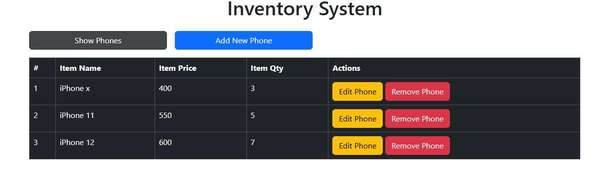

# 📱 Inventory System

Simple inventory system using JavaScript to manage phones.

## ✨ Features

- Add new phones
- Edit existing items
- Delete items
- Dynamic table update
- Responsive design using Bootstrap

# Inventory System

A simple inventory management system built using HTML, CSS, JavaScript, and Bootstrap.  
It allows users to add, edit, and delete phone items dynamically.

## 🚀 Technologies Used

- HTML5
- CSS3
- JavaScript (DOM Manipulation)
- Bootstrap 5

## 📸 Project Preview

  

## 🌐 Live Demo

[Click here to view the project](https://Eslam-Mohamed-1892.github.io/inventory-system/)

## 💻 GitHub Repo

https://github.com/Eslam-Mohamed-1892/inventory-system

## 📌 How to Run

1. Download the project
2. Open index.html in your browser
